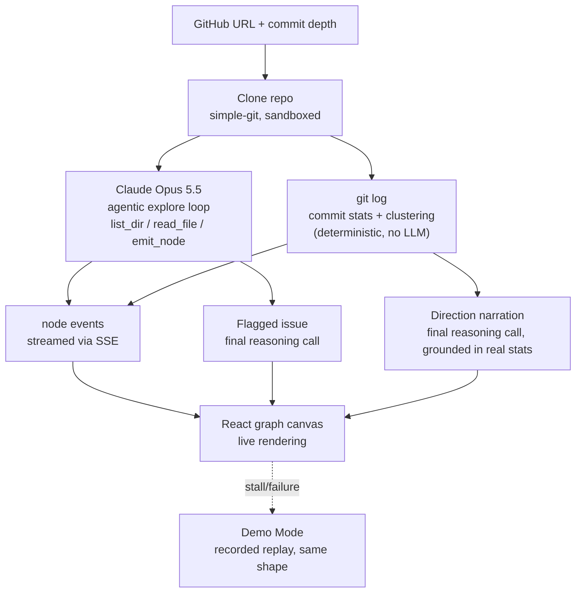

# 🗺️ CodeArchaeologist

### Live Agentic Codebase Explorer — Structural Mapping, Commit-History Direction, and a Verifiable Flagged Issue

[](https://your-deployment-url.vercel.app/)
[](https://github.com/nikhil-0420/CodeArch)
[](https://nodejs.org/)
[](https://react.dev/)
[](https://expressjs.com/)
[](https://www.anthropic.com/)

[**Live App**](https://your-deployment-url.vercel.app/) · [**Repo**](https://github.com/nikhil-0420/CodeArch) · [**Report Bug**](https://github.com/nikhil-0420/CodeArch/issues)

> ⚠️ **Note:** Demo Mode replays a real recorded run (not synthetic data) whenever the live agent run stalls or fails, so a demo never depends on a live API call succeeding on stage.

---

## 📌 Overview

Inheriting an unfamiliar codebase usually means clicking through folders for
30+ minutes just to figure out what's load-bearing. Existing tools either give
you a static dependency graph or a chat window over pre-indexed files —
neither shows you *how* the understanding was built.

CodeArchaeologist does it live:

- Paste a GitHub URL and watch **Claude Opus 5.5 explore the repo as an
  agent** — choosing what to read next via tool calls (`list_dir`,
  `read_file`, `emit_node`), not working from a pre-built index
- Watch the **architecture graph build node by node in real time**, streamed
  over SSE as Claude's exploration happens
- Get **one concrete, checkable issue** flagged in code Claude has never
  seen before, from a separate final reasoning call
- Feed it a **commit-history window (10–50 commits)** and it layers on
  deterministic commit analysis — computed in plain code, never by the
  model — to mark files **active vs. stale**, group **collaboration
  clusters** (files multiple authors are touching together), and have
  Claude narrate the project's **recent direction** grounded in that data
- Falls back to a **recorded Demo Mode replay** — same event shape, same
  timing — if a live run stalls, so a flaky network or API hiccup never
  strands the demo

Built as a 3-person hackathon team build: live exploration loop, graph
rendering, and landing/reveal UI split across members and integrated into
one full-stack app.

---

## 🖥️ App Preview

*(screenshot placeholder — add `./assets/graph-view.png` once captured)*

The app includes:

- **Landing** — GitHub URL input plus a commit-depth selector (10–50)
- **Explore View** — the live graph: nodes stream in as Claude reads files,
  colored/shaded by importance and by active-vs-stale status, with
  collaboration clusters visually grouped
- **Issue Reveal** — the one flagged issue, with a typewriter-style reveal
  and the specific file(s) highlighted on the graph
- **Direction Reveal** — Claude's narration of where the project is
  heading, plus the stale files and active clusters the code computed
- **Demo Mode** — a manual toggle, and an automatic fallback that switches
  over with a visible "cached run" indicator if the live stream stalls

---

## ✨ Features

| Feature | Description |
| --- | --- |
| 🕵️ **Live Agentic Exploration** | Claude Opus 5.5 decides what to read next via real tool calls — not a pre-computed index — and each decision streams to the browser as it happens |
| 🗺️ **Real-Time Architecture Graph** | Nodes appear one by one with role, importance, and import links as Claude discovers them |
| 🚩 **Verifiable Flagged Issue** | A separate final call names one concrete, checkable problem in the repo — or honestly reports none found |
| 📊 **Commit-Driven Direction** | User-specified commit window (10–50) analyzed deterministically for per-file touch count, author count, and recency |
| 👥 **Collaboration Clusters** | Files touched by overlapping sets of authors in the same area are grouped and surfaced as active hotspots |
| 🪦 **Stale File Detection** | Files untouched in the analyzed window (or beyond a recency threshold) are flagged, not guessed at |
| 🔒 **Sandboxed File Access** | Path traversal, absolute paths, and symlinks are all refused — verified against repeated attack attempts |
| ⏱️ **Hard Run Limits** | Capped at 25 emitted nodes, 90 seconds of exploration, and 60 file reads per run |
| 🎬 **Demo Mode Fallback** | Automatic switch to a real recorded replay if the live stream stalls, with a visible "cached run" badge — never silent |
| 💸 **Cost Guardrails** | Runs stop on browser disconnect, reconnects can't trigger a duplicate paid run, and temp clone folders are cleaned up after every run |

---

## 🏗️ Tech Stack

**AI**

- Claude Opus 5.5 (Anthropic API) — agentic tool-use loop for exploration, plus a separate structured call for the flagged issue and project direction

**Backend**

- Node.js · Express
- `simple-git` for shallow cloning and commit-history extraction
- Server-Sent Events (SSE) for live streaming to the client
- Deterministic commit-stats and clustering logic (no LLM calls) in `gitHistory.js` / `clustering.js`

**Frontend**

- React + Vite
- Custom `useSSE` hook driving a live-updating graph canvas
- Deployed on Vercel

---

## 📐 Architecture



---

## 📊 Results

**Live exploration runs** — tested against real public repos:

| Repo | Nodes | Time | Result |
| --- | --- | --- | --- |
| `jonschlinkert/is-odd` | 3 | ~25s | Issue flagged |
| `expressjs/session` | 9–11 | ~45s | Correct import links, issue flagged |

**Commit-history analysis** — tested at multiple commit depths:

| Repo | Commit depth | Result |
| --- | --- | --- |
| `expressjs/session` | 50 | 22 distinct authors detected, cluster author-count correctly aggregated |
| `expressjs/session` | 15 | Correct narrower cluster, stale files identified |
| `jonschlinkert/is-odd` | default | Correctly identified as dormant — 0 clusters, all files stale |
| `CodeArch` (self-analysis) | 15 requested, 4 available | No error; honestly reports thin history rather than fabricating a pattern |

**Safety checks:**

| Check | Result |
| --- | --- |
| Path traversal attempts (`..`, absolute paths, symlinks) | 7/7 refused |
| Invalid or missing repo URL | Correct error, returned quickly |
| Private repo | Fails fast, no hang on login prompt |

> **Honest framing:** the flagged-issue and direction claims are LLM
> inferences over partial, truncated reads — they are not a substitute for
> a human reviewing the actual diff. Commit-derived facts (touch count,
> author count, recency) are computed deterministically in code and are
> independently checkable against `git log` yourself.

---

## 🚀 Getting Started

### Prerequisites

- Node.js 18+
- An [Anthropic API key](https://console.anthropic.com/) (for the exploration and reasoning calls)
- Git installed locally

### 1. Clone the repository
```bash
git clone https://github.com/nikhil-0420/CodeArch.git
cd CodeArch
```

### 2. Install dependencies
```bash
npm install
npm install --prefix client
```

### 3. Configure environment
Create `.env` in the project root (or `server/.env`):
```env
ANTHROPIC_API_KEY=your_anthropic_key_here
```

### 4. Run it
```bash
npm run dev
```

Server runs at `http://localhost:8787`

### Optional
```bash
npm run dev:hmr   # separate client/server dev servers with hot reload
```

---

## 📂 Project Structure

```text
CodeArch/
├── server/
│   ├── agent.js          # Claude Opus 5.5 explore loop + flagged-issue + direction calls
│   ├── tools.js           # list_dir / read_file tool implementations
│   ├── sandbox.js         # path-traversal / symlink protection
│   ├── gitHistory.js      # deterministic commit-stats extraction (git log)
│   ├── clustering.js      # deterministic collaboration-cluster + staleness logic
│   ├── env.js              # single source of truth for env loading
│   ├── demo-log.json      # recorded real run, used by Demo Mode replay
│   └── routes/
│       ├── explore.js     # POST /api/explore/start, GET /api/explore/stream/:id
│       └── demo.js        # GET /api/demo/replay
├── client/
│   └── src/
│       ├── LandingInput.jsx     # URL + commit-depth input
│       ├── ExploreView.jsx      # wires SSE stream to the graph
│       ├── GraphCanvas.jsx      # live node/edge rendering, activity + cluster styling
│       ├── IssueReveal.jsx      # flagged-issue reveal
│       ├── DirectionReveal.jsx  # direction / stale files / clusters reveal
│       └── hooks/useSSE.js      # EventSource hook (node / done / direction events)
├── shared/
│   └── types.ts           # shared event + data contract between client and server
└── README.md
```

---

## 🔬 Methodology Highlights

1. **Live judgment, not a pre-built index** — the exploration order itself
   is a decision Claude makes in real time via tool calls, not a
   deterministic traversal computed up front
2. **Deterministic where it counts** — commit stats and clustering are
   computed in plain code from real `git log` output, never asked of
   Claude, so those numbers are independently checkable and not an LLM
   inference
3. **Grounded narration** — Claude's "direction" call only narrates
   pre-computed real data; it never invents the stale-file list or cluster
   membership itself
4. **Hard caps over open-ended runs** — 25 emitted nodes, 90-second wall
   clock, and 60 file reads bound both cost and demo time regardless of
   repo size
5. **A real fallback, clearly labeled** — Demo Mode replays an actual
   recorded run rather than synthetic placeholder data, and is always
   visibly marked as a cached run, automatically or manually triggered

---

## 🎯 Key Findings

- Import edges based only on "both files were listed or read" over-claim
  relationships; verifying an edge as a real import needs a stricter check
  than co-occurrence in the exploration trace
- Commit-derived signals (touch count, author overlap, recency) are far
  more defensible under scrutiny than a structural-only inference, since a
  judge can independently verify them against `git log` themselves
- Shallow clones (`--depth 1`) don't carry enough history for commit
  analysis — the clone step needs to fetch at least as many commits as the
  requested analysis depth
- A single-author, long-dormant repo is a valid and informative result
  (all files stale, no clusters) — the system needs to present that as an
  honest finding, not an error state
- Demo reliability depends on treating "the live run stalled" as an
  expected case with a designed fallback, not an edge case to patch later

---

## 🔮 Known Limitations

- **Import-edge verification** currently confirms only that both files
  were observed during exploration, not that an import statement actually
  exists between them — a stricter static check would strengthen this
- **Flagged issues and direction narration are unverified LLM inferences**
  over partial, truncated file reads (4,000 characters per file) — treat
  them as a starting point for review, not a proof
- **No aggregate spend or concurrency limit** across runs — per-run caps
  exist, but nothing yet bounds total cost if many runs happen in parallel
- **"Never seen this code before" is unprovable** for any public repo —
  the app hasn't previously indexed it, but training-data exposure can't
  be ruled out
- Commit-history analysis on a repo's default branch reflects whatever
  that branch currently is — it will not reflect a not-yet-merged branch
  unless explicitly pointed at it

---

## 👤 Team

**Nikhil** — Backend (exploration loop, commit-history analysis)
[GitHub](https://github.com/nikhil-0420)

Frontend graph rendering and landing/reveal UI built by teammates as part
of a 3-person hackathon build.

---

**⭐ If you found this project interesting, consider giving it a star.**